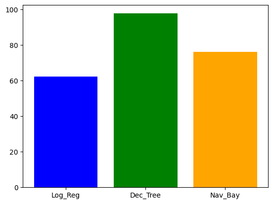
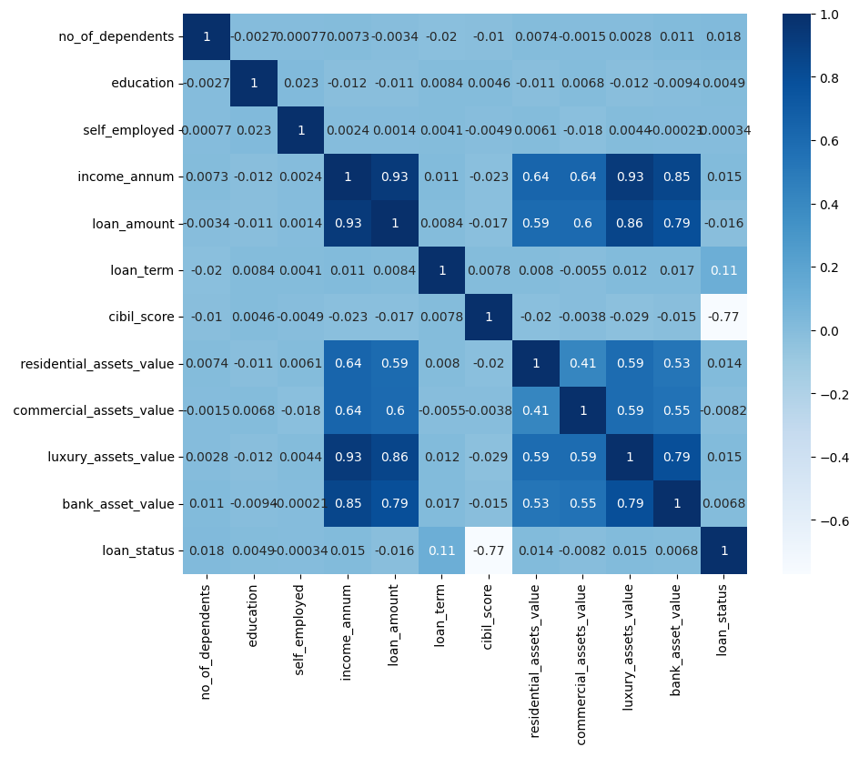

# 🧠 Loan Approval Prediction Using Machine Learning

A machine learning project to automate loan approval decisions based on applicant data, aiming to reduce human bias and improve processing efficiency in financial institutions.

---

## 📌 Project Overview

This project develops a predictive system for classifying loan applications as **Approved** or **Rejected** using machine learning techniques. It provides an end-to-end data science workflow, from preprocessing raw financial data to training and comparing multiple classification models.

---

## 🔍 Problem Statement

Traditional loan approval processes are often:
- Time-consuming
- Prone to human error
- Susceptible to bias

This project addresses these issues by providing a **data-driven solution** to automate loan decision-making.

---

## 🎯 Objectives

- Clean and preprocess loan applicant data
- Train and evaluate machine learning models for classification
- Identify key financial indicators that impact loan decisions
- Compare performance of selected models

---

## 🧪 Dataset Features

The dataset includes the following features:

- `no_of_dependents`
- `education`
- `self_employed`
- `income_annum`
- `loan_amount`
- `loan_term`
- `cibil_score`
- `residential_assets_value`
- `commercial_assets_value`
- `luxury_assets_value`
- `bank_asset_value`
- `loan_status` (Target variable)

---

## 🧹 Data Preprocessing

- Handling missing values
- Encoding categorical features (`education`, `self_employed`)
- Normalizing/standardizing numerical features
- Data splitting (training and test sets)

---

## 🤖 Models Used

After preprocessing, we applied and compared the following models:

1. **Logistic Regression**
2. **Naive Bayes**
3. **Decision Tree**

📊 Below is a visual performance comparison:

---

## 📈 Correlation Matrix

A heatmap showing correlations between input variables and the target label:

---

## 🧪 Evaluation Metrics

Models were evaluated using:
- Accuracy
- Precision
- Recall
- F1-Score

> 🏆 Among the models, **Decision Tree** performed the best in terms of accuracy.

---

## 🛠️ Tools & Technologies

- **Language**: Python
- **Libraries**: `pandas`, `numpy`, `matplotlib`, `seaborn`, `scikit-learn`
- **Platform**: Jupyter Notebook / Google Colab

---

## ✅ Conclusion

This project demonstrates how machine learning can enhance loan processing by reducing bias and improving accuracy. The final model can be further integrated into financial systems for real-time approval assistance.
